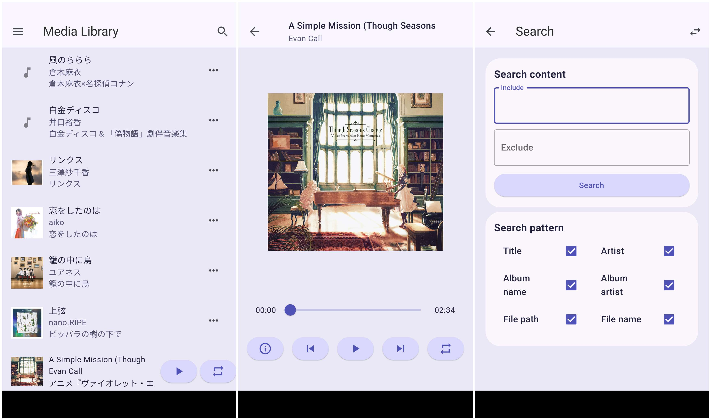
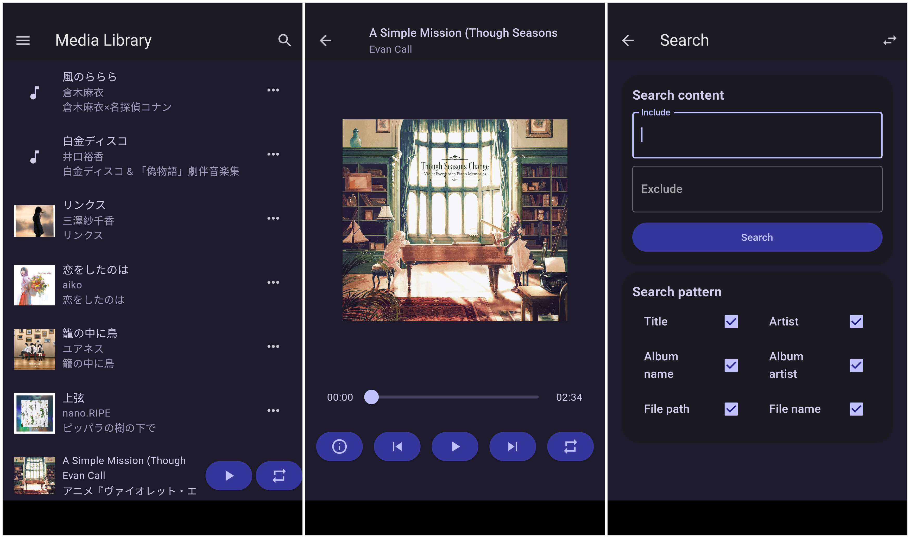

<div align="center">
    <p>
    <h1>
        
        <br/>
        MPax
    </h1>
    <p>
        <a href="https://github.com/realth000/mpax_flutter/releases">
            </a>
        <a href="https://github.com/realth000/mpax_flutter/releases">
            </a>
        <a href="https://github.com/realth000/mpax_flutter/releases">
            </a>
        <a href="https://github.com/realth000/mpax_flutter/releases">
            </a>
        <a href="https://flutter.dev/">
            </a>
        <a href="https://github.com/realth000/mpax_flutter/blob/master/LICENSE">
            </a>
        <a href="https://www.codacy.com/gh/realth000/mpax_flutter/dashboard?utm_source=github.com&amp;utm_medium=referral&amp;utm_content=realth000/mpax_flutter&amp;utm_campaign=Badge_Grade">
            </a>
    </p>
</div>

English|[简体中文](./docs/README_zh_CN.md)

## Work In Progress

Refactoring, not fully usable.

## Introduction

MPax is a simple and easy-to-use music player powered by flutter.

## Screenshots




## Features

### Audio:

* [x] Music playing.
* [x] Read metadata (now is part of).
* [ ] Modify metadata.
* [ ] Playlist (partly).
* [x] Search.
* [ ] Lyric.
* [ ] Global shortcut on Windows.
* [ ] Global shortcut on Linux.
    * [ ] Hyprland.
* [ ] MPRIS.

### UI:

* [x] Dark mode.
* [ ] Duration to auto stop.
* [ ] Multiple views (In album, artist, folder...).
* [ ] Shortcut.

### Platforms:

* [x] Android.
* [x] Linux.
* [x] Windows.

## Keymap (Desktop platforms)

* ~~Play Previous: ``Ctrl + Alt + <-``~~
* ~~Play Next: ``Ctrl + Alt + ->``~~
* ~~Play/Pause: ``Ctrl + Alt + B``~~

## Install

[Download here.](https://github.com/realth000/mpax_flutter/releases)

* Android: mpax_flutter-version.apk
* Linux: mpax_flutter-version.tar.gz
* Windows: mpax_flutter-version.zip

## Build From Source

Prepare source code:

``git clone --recursive https://github.com/realth000/mpax_flutter.git``

### Android

Build Android libs:

``` shell
cd lib/package/taglib_ffi/Meipuru
./script/build_android.sh libs
cp -r libs ../../../../android/app/
```

Build Android *.apk:

``flutter build android --release``

### Linux

* Debian:
    1. ``sudo apt install libgstreamer1.0-dev libgstreamer-plugins-base1.0-dev libtagc0-dev``
    2. ``flutter build linux --release``
* Arch:
    1. ``sudo pacman -S gst-plugins-good``
    2. ``flutter build linux --release``

Build and install Linux libs:

``` shell
cd lib/package/taglib_ffi/Meipuru
mkdir build
cd build
cmake ../ && cmake --build -j8
strip *.so
cp *.so ../../../../../build/linux/x64/debug/realease/lib
```

### Windows

``flutter build windows --release``

Build and build Windows libs similar to Linux steps.
